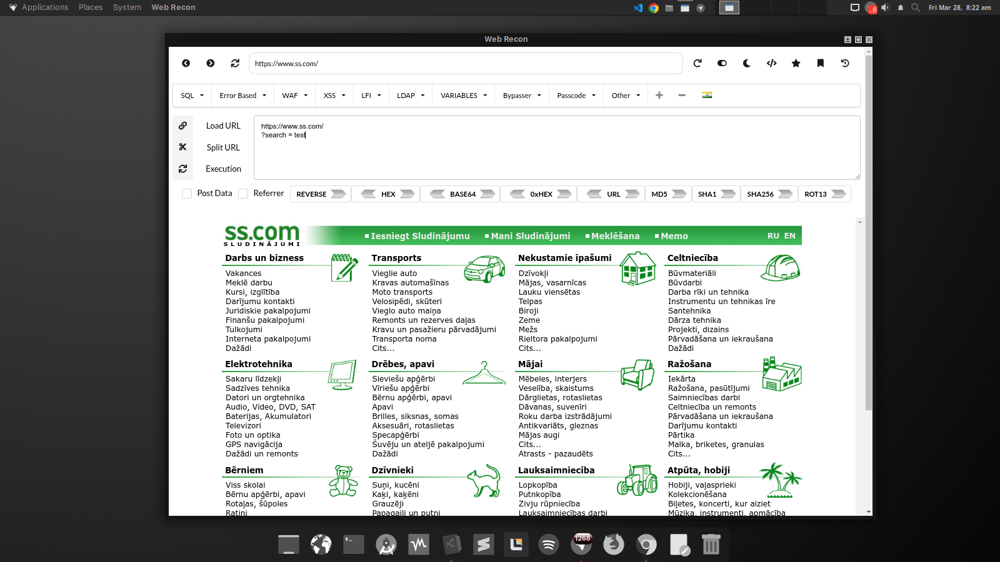

# **Web Recon - Hackbar WebView**
A lightweight **Hackbar-style** tool built with **Electron and WebView** for web security testing, request modification, and payload injection.  

## **Features**  
Browse and test websites directly in **WebView**  
Modify **GET/POST** requests manually  
Encode/Decode **Base64, URL encoding** etc.. 
Inject **XSS, SQLi, and custom payloads**  
**Payload** Library
**Dark** Theme

## **Installation**  
### **🔹 Prerequisites**  
- **Node.js** (Download from [nodejs.org](https://nodejs.org))  
- **Git** (Optional for cloning)  

### **🔹 Clone & Setup**  
```sh
git clone https://github.com/your-username/hackbar-webview.git
cd hackbar-webview
npm install
```
## **Run the Application**  
```sh
npx electron .
```
or  
```sh
npm start
```
## **Build for Distribution**  
To package the app as an executable:  
```sh
npm install electron-packager -g
electron-packager . Hackbar-WebView --platform=win32 --arch=x64 --out=dist/
```
This will create a `dist/` folder with a runnable **.exe** file.  

## **Download Prebuilt Releases**  
For convenience, you can download the prebuilt **AppImage** (Linux) release:  

🔹 **Linux (AppImage)** – [Download Here](https://github.com/mr-bipolar/web-recon/releases)   
🔹 **Windows (.exe)** – *(Coming soon...)*  

After downloading the AppImage, make it executable:  
```sh
chmod +x Hackbar-WebView.AppImage
./Hackbar-WebView.AppImage
```

## **Screenshots**  
  

## **Contributing**  
Pull requests are welcome! If you'd like to contribute, fork the repo and create a PR.  


## **License**  
MIT License - Free to use and modify.  


